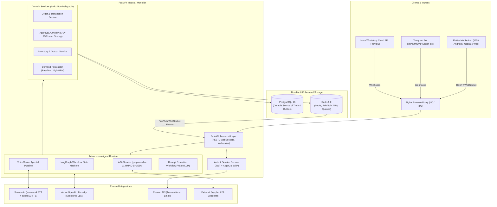
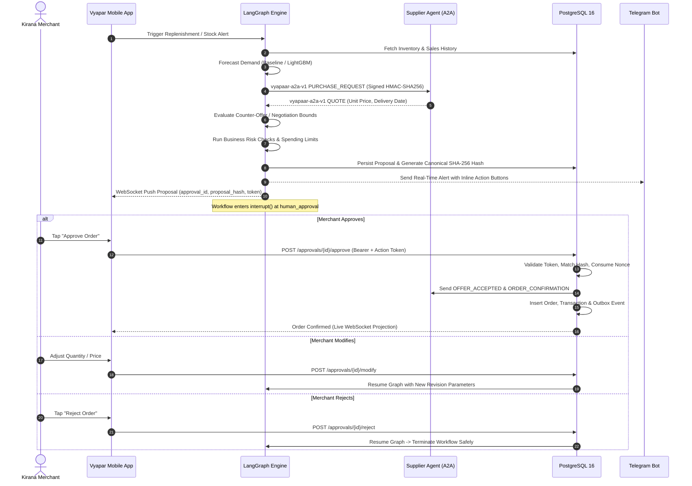

# Paytm ONE Vyapar (Vyapaar Commander)

<div align="center">

[](LICENSE)
[](backend/pyproject.toml)
[](backend/app/main.py)
[](vyapar/pubspec.yaml)
[](vyapar/pubspec.yaml)
[](backend/Dockerfile)
[](backend/docker-compose.yml)
[](tests/)
[](.github/workflows/ci.yml)

**Autonomous AI Supply Chain Orchestration, Bounded Agent Negotiation, and Real-Time Indic Voice Commerce for Indian Retailers (Kiranas).**

[Features](#-key-features) •
[Architecture](#-system-architecture) •
[Workflow](#-autonomous-replenishment-lifecycle) •
[Voice Pipeline](#-multilingual-voice-pipeline-munim-ai) •
[Quick Start](#-quick-start) •
[Deployment](#-production-deployment) •
[Testing](#-testing--verification) •
[Security](#-security--execution-invariants)

</div>

---

## 📌 Executive Summary

**Paytm ONE Vyapar (Vyapaar Commander)** is an enterprise-grade, autonomous commerce platform built for India’s micro, small, and medium retailers (*kirana* stores). Managing inventory and reordering goods is traditionally fraught with stockouts, price volatility, opaque supplier terms, and language hurdles.

Vyapaar Commander bridges this gap through an **agentic modular monolith** paired with a **feature-first Flutter mobile application**:

1. **Autonomous Demand Intelligence**: Detects low stock and projects future demand using baseline statistical algorithms and LightGBM models trained on local sales, weather patterns, and regional calendar events.
2. **Autonomous Supplier Negotiation**: Conducts bounded, cryptographic Agent-to-Agent (`vyapaar-a2a-v1`) negotiations with registered supplier agents to secure optimal wholesale pricing.
3. **Cryptographic Human-in-the-Loop Gate**: Guarantees zero unverified spend. Proposals are canonicalized and signed with SHA-256 hashes, requiring explicit merchant authorization via short-lived, single-use action tokens.
4. **"Munim AI" Multilingual Voice Assistant**: Enables natural-voice interactions in Indian languages (Hindi, Hinglish, Tamil, Telugu, Gujarati, Marathi, Bengali, Kannada, English) powered by Sarvam AI's real-time speech streaming models.
5. **Multimodal AI Receipt Ingestion**: Digitizes paper distributor invoices into live catalog inventory through Vision AI extraction and fuzzy catalog reconciliation.
6. **Omnichannel Interaction**: Delivers alerts and one-tap approvals across Flutter, an interactive Telegram Bot (`@PaytmOneVyapar_bot`), Meta WhatsApp Cloud API (preview), and transactional email.

---

## 🚀 Key Features

### 1. Autonomous Inventory Replenishment (LangGraph)
- Cyclical workflow: `detect_need` → `forecast_demand` → `find_supplier` → `negotiate` → `risk_check` → `create_proposal` → **`human_approval` (interrupt)** → `execute_order` → `verify_result`.
- LangGraph checkpointing backed by PostgreSQL (`AsyncPostgresSaver`) for durable state persistence across server restarts, with in-memory fallback for lightweight testing.

### 2. Signed Agent-to-Agent Procurement Protocol (`vyapaar-a2a-v1`)
- Custom, project-owned protocol enabling secure machine-to-machine negotiation between buyer and supplier agents.
- Lowercase hex **HMAC-SHA256** message signing over sorted canonical JSON payloads.
- Strictly validated intent lifecycle: `PURCHASE_REQUEST`, `QUOTE`, `COUNTER_OFFER`, `OFFER_ACCEPTED`, `ORDER_CONFIRMATION`, and `DELIVERY_CONFIRMATION`.
- Guaranteed replay protection through monotonic nonces, clock-skew checks (300s window), and business idempotency keys.

### 3. "Munim AI" Real-Time Voice Streaming (Sarvam AI)
- Sub-second conversational voice experience with **Sarvam AI `saaras:v4`** real-time STT and **`bulbul:v3`** streaming neural TTS.
- Continuous mono PCM16 16 kHz audio streaming over authenticated WebSockets.
- Anti-stuttering prebuffer with 300 ms playback window and natural voice cleanup (removes markdown symbols, handles bilingual text, converts Urdu Nastaliq script to Devanagari).
- Native intent extraction for stock alerts, purchase requests, approval actions, and general queries.

### 4. Multimodal AI Receipt Scanning & Ingestion
- Upload or capture distributor paper receipts directly in the mobile client.
- Multi-modal Vision LLM pipeline parses store metadata, line items, quantities, prices, and tax rates.
- Automatic fuzzy reconciliation matches extracted invoice lines against existing merchant SKUs.
- Interactive merchant review screen allows quantity and price adjustments before one-tap inventory ledger commits.

### 5. Cross-Platform Flutter Client (`vyapar`)
- Modern, layered feature-first architecture (`app`, `core`, `design_system`, `features`, `shared`).
- **Riverpod 3.0** state management (`AsyncNotifier`, `Notifier`, family providers).
- **GoRouter** with authenticated shells, deep-linking, and session recovery.
- Centralized design tokens (colors, typography, spacing, radii, motion) derived from Paytm blue and emerald palettes.
- High-performance UI utilizing slivers (`CustomScrollView`), skeleton shimmer loading states, and custom canvas backgrounds (`AuroraBackground`, `OrganicPattern`).

### 6. Interactive Multi-Channel Operations
- **Telegram Bot Channel**: Active interactive channel (`@PaytmOneVyapar_bot`) supporting merchant alerts, one-tap approval buttons (`POST /webhooks/telegram`), and OTP codes.
- **WhatsApp Cloud API**: Meta Graph API webhook integration for WhatsApp Business approval templates (preview status).
- **Transactional Email**: Resend integration for multi-channel OTP delivery.

---

## 🏛️ System Architecture



---

## 🔒 Security & Execution Invariants

Vyapaar Commander operates on strict defense-in-depth principles:

```text
structured agent suggestion
  → validated command
  → application service
  → identity, authorization, spending limits, proposal SHA-256 hash, expiry, nonce
  → deterministic transaction service
  → supplier side-effect & outbox event
```

1. **Strict Non-Delegation**: LLMs produce structured data (Pydantic models) only. LLMs are **never** given database mutation, payment execution, or order placement credentials.
2. **Dual-Token Approval Gate**:
   - Proposal parameters are serialized in canonical sorted key order and hashed via **SHA-256**.
   - An approval record binds the merchant, proposal, hash, nonce, and expiry.
   - The merchant executes orders using an authenticated access token AND a short-lived, single-use action token.
   - Any modification supersedes the previous proposal, creating a new proposal revision, hash, and action token.
3. **Durable Truth vs. Ephemeral State**:
   - PostgreSQL owns all business data, outbox events, and audit logs.
   - Redis is used strictly for distributed locks, pub/sub fanout, and background queue coordination.
4. **Zero Raw Audio Logging**: Audio streams are processed in-memory for STT and immediately discarded. No credentials, tokens, or raw voice data are ever written to persistent logs.

---

## 🔄 Autonomous Replenishment Lifecycle



---

## 🎙️ Multilingual Voice Pipeline ("Munim AI")

```mermaid
flowchart LR
    Mic["User Voice (Microphone)"] -->|PCM16 16kHz Mono| FlutterWS["Flutter WebSocket Client"]
    FlutterWS -->|Binary Stream| VoiceRoute["FastAPI /voice/sessions/stream"]
    VoiceRoute -->|Streaming Audio| SarvamSTT["Sarvam AI saaras:v4 STT"]
    SarvamSTT -->|Partial & Final Transcripts| IntentEngine["Regex & Structured Intent Classifier"]
    
    subgraph IntentEngine["Intent Classification & Execution"]
        Classifier{"Recognized Intent"}
        Classifier -->|Stock Alert| ReplenishFlow["Trigger Purchase Run"]
        Classifier -->|Approve/Modify| ApprovalFlow["Process Approval Action"]
        Classifier -->|Inventory/Sales| ContextFlow["Munim Context Tools"]
        Classifier -->|Conversational| LLMFallback["Azure OpenAI / Indic Fallback"]
    end

    ReplenishFlow --> ResponseBuilder["Voice Response Builder (i18n)"]
    ApprovalFlow --> ResponseBuilder
    ContextFlow --> ResponseBuilder
    LLMFallback --> ResponseBuilder

    ResponseBuilder -->|Clean Devanagari / Latin Text| SarvamTTS["Sarvam AI bulbul:v3 Neural TTS"]
    SarvamTTS -->|Streaming linear16 / mp3 Chunks| AudioBuffer["Client Anti-Stuttering Buffer (300ms)"]
    AudioBuffer --> Speaker["Merchant Speaker Playback"]
```



### Supported Languages & Personas
- **Hindi (`hi-IN`)**: Full colloquial support, Devanagari script normalization.
- **Hinglish**: Seamless code-mixed vocabulary (*"bhaiya teen peti cold drink aur mangwa do"*).
- **Tamil (`ta-IN`)**, **Telugu (`te-IN`)**, **Kannada (`kn-IN`)**, **Gujarati (`gu-IN`)**, **Marathi (`mr-IN`)**, **Bengali (`bn-IN`)**, and **English (`en-IN`)**.
- **Voice Persona**: Sarvam `ritu` / `roopa` neural high-fidelity voice profiles.

---

## 📂 Repository Structure

```text
ProjectPaytmOneVyapar/
├── .github/
│   └── workflows/
│       └── ci.yml                 # Automated CI (Ruff, Pytest, Flutter analyze & test)
├── backend/                       # FastAPI Modular Monolith
│   ├── app/
│   │   ├── a2a/                   # vyapaar-a2a-v1 signed protocol & transports
│   │   ├── agents/                # LangGraph state machine, nodes, tools & Munim context
│   │   ├── api/v1/                # REST endpoints, WebSockets & webhook routes
│   │   ├── application/           # Business services, commands, and transaction boundaries
│   │   ├── channels/              # Voice (Sarvam), Telegram bot, and WhatsApp adapters
│   │   ├── core/                  # Configuration, logging, errors, and security
│   │   ├── domain/                # Pydantic entities, enums, events, and contracts
│   │   ├── infrastructure/        # SQLAlchemy 2.0 ORM, Redis, Outbox, and Telemetry
│   │   ├── integrations/          # External adapters (Azure OpenAI, Resend, Suppliers)
│   │   ├── ml/                    # Demand forecasting (Baseline & LightGBM)
│   │   └── workers/               # ARQ background worker settings and task definitions
│   ├── docs/                      # Backend architecture, A2A, and voice guide
│   ├── migrations/                # Alembic database migrations
│   ├── scripts/                   # Demo seeds and credential-free happy path runner
│   ├── tests/                     # 115 tests: Unit, API, Agents, Voice, and Security
│   ├── Dockerfile                 # Multi-stage production Python 3.13 image
│   ├── Makefile                   # Backend-specific convenience commands
│   └── pyproject.toml             # Python dependencies and tool configuration
├── vyapar/                        # Flutter Cross-Platform Client
│   ├── assets/                    # Icons, logos, and illustration assets
│   ├── integration_test/          # End-to-end device integration tests
│   ├── lib/
│   │   ├── app/                   # App bootstrap, GoRouter, shell, and lifecycle
│   │   ├── core/                  # Networking (Dio), Auth token store, and Realtime
│   │   ├── design_system/         # Tokens (colors, typography), custom icons & widgets
│   │   ├── features/              # Feature modules (auth, home, inventory, munim, voice...)
│   │   ├── l10n/                  # Localization files (ARB translations)
│   │   └── shared/                # Formatters, validators, and utility helpers
│   ├── test/                      # 69 tests: Unit, widget, and golden tests
│   └── pubspec.yaml               # Flutter dependencies and assets
├── deploy/                        # Production Deployment Configurations
│   ├── docker-compose.prod.yml    # Production Docker Compose stack
│   ├── nginx.conf                 # Nginx reverse proxy with WebSocket support
│   └── vm-init.sh                 # Cloud-init bootstrap script for Ubuntu/Azure VMs
├── design_reference/              # Design mockups, wireframes, and screenshots
├── .editorconfig                  # Monorepo code style settings
├── .env.example                   # Master environment template
├── .gitignore                     # Monorepo gitignore
├── CODE_OF_CONDUCT.md             # Contributor Covenant v2.1
├── CONTRIBUTING.md                # Developer guide, conventions, and invariants
├── LICENSE                        # Apache License 2.0
├── Makefile                       # Root monorepo orchestration Makefile
└── README.md                      # Project documentation (this file)
```

---

## 🛠️ Tech Stack Matrix

| Layer | Technologies |
| :--- | :--- |
| **Backend Framework** | [FastAPI](https://fastapi.tiangolo.com/) 0.141, [Uvicorn](https://www.uvicorn.org/) 0.53, [Pydantic V2](https://docs.pydantic.dev/) |
| **Agent Orchestration** | [LangGraph](https://github.com/langchain-ai/langgraph) 1.2, [LangChain](https://github.com/langchain-ai/langchain) 1.4 |
| **Database & Cache** | [PostgreSQL 16](https://www.postgresql.org/) with [SQLAlchemy 2.0](https://www.sqlalchemy.org/) Async, [asyncpg](https://github.com/MagicStack/asyncpg), [Alembic](https://alembic.sqlalchemy.org/), [Redis 8.2](https://redis.io/) (Pub/Sub, Locks, ARQ Queue) |
| **Voice & Speech AI** | [Sarvam AI](https://sarvam.ai/) (`saaras:v4` Realtime STT, `bulbul:v3` Streaming Neural TTS) |
| **Vision & Language AI** | [Azure OpenAI / Foundry](https://azure.microsoft.com/products/ai-services/openai-service) (`gpt-5.6-luna`, structured output), Vision Receipt OCR |
| **Machine Learning** | [LightGBM 4.7](https://lightgbm.readthedocs.io/), [scikit-learn](https://scikit-learn.org/), [pandas](https://pandas.pydata.org/), [numpy](https://numpy.org/) |
| **Channels & Comms** | [python-telegram-bot](https://python-telegram-bot.org/), Meta WhatsApp Cloud API (v21.0), [Resend](https://resend.com/) Email |
| **Mobile Client** | [Flutter 3.24+](https://flutter.dev/), [Dart 3.5+](https://dart.dev/), [Flutter Riverpod 3.1](https://riverpod.dev/), [GoRouter 17.5](https://pub.dev/packages/go_router), [Dio 5.11](https://pub.dev/packages/dio) |
| **Mobile Hardware** | [record](https://pub.dev/packages/record) (PCM16 16kHz microphone capture), [flutter_pcm_sound](https://pub.dev/packages/flutter_pcm_sound) (low-latency PCM playback), [image_picker](https://pub.dev/packages/image_picker) |
| **DevOps & Deploy** | [Docker](https://www.docker.com/), [Docker Compose](https://docs.docker.com/compose/), [Nginx](https://nginx.org/), Ubuntu 22.04 LTS / Azure Cloud-Init |
| **Observability** | [OpenTelemetry SDK](https://opentelemetry.io/), [Sentry](https://sentry.io/), [structlog](https://www.structlog.org/) |

---

## ⚡ Quick Start

### 1. Prerequisites
- **Python 3.12–3.14** (Python 3.13 recommended)
- **[uv](https://docs.astral.sh/uv/)** package manager
- **Flutter SDK 3.24+**
- **Docker & Docker Compose**

### 2. Clone & Install
```bash
git clone https://github.com/axiomchronicles/PaytmOneVyapar.git
cd PaytmOneVyapar

# Install dependencies for both backend and Flutter
make install
```

### 3. Local Infrastructure
```bash
# Start local PostgreSQL and Redis containers
make infra-up
```

### 4. Configure Backend
```bash
cd backend
cp .env.example .env
# Set your DATABASE_URL and generate 32+ character secrets for:
# AUTH_JWT_SECRET, AUTH_APPROVAL_SECRET, AUTH_OTP_SECRET, and A2A_SIGNING_SECRET
cd ..
```

### 5. Apply Migrations & Seed Demo Data
```bash
make migrate
make seed
```

> [!NOTE]
> The seed script creates an initial demo merchant:
> - **Username**: `merchant@vyapaar.local`
> - **Password**: `demo-change-me`
> - **Preloaded Data**: Store catalog, low-stock cold drink SKU (`COLD-COLA-300`), 90 historical sales records with weather/event features, and registered A2A supplier agents.

### 6. Run Services
In separate terminal windows:
```bash
# Terminal 1: FastAPI Backend
make dev-backend

# Terminal 2: ARQ Background Worker (for Outbox event delivery)
make dev-worker

# Terminal 3: Flutter Mobile Client
make dev-frontend
```

### 7. Run Credential-Free Happy Path Demo
You can execute the entire replenishment, A2A negotiation, cryptographic proposal hashing, and order execution cycle without any external credentials or database connections:
```bash
make demo
```
Output:
```text
LOW INVENTORY -> DEMAND FORECAST -> SUPPLIER A2A -> NEGOTIATION -> APPROVAL
APPROVAL -> HASH VERIFIED -> ORDER EXECUTION -> SUPPLIER CONFIRMATION -> OUTCOME
{'order_id': '03f85094-e008-57f5-8dd3-67b679d34f4c', 'status': 'CONFIRMED', 'supplier_confirmation': 'BWW-40A86FF05C'}
```

---

## 🧪 Testing & Verification

The repository includes a comprehensive, multi-layer test suite with **184 automated tests**:

```bash
# Run all backend and frontend tests
make test

# Run backend tests only (115 passing tests)
make test-backend

# Run Flutter tests only (69 passing tests)
make test-frontend

# Run linters across the entire codebase
make lint
```

### Test Breakdown
- **Backend (`backend/tests/`)**:
  - `tests/unit/`: Domain entities, hashing, validators, and baseline forecasting.
  - `tests/api/`: REST endpoints, authentication, and cursor pagination.
  - `tests/agents/`: LangGraph node transitions, purchase graph, and receipt processing.
  - `tests/security/`: Proposal hash tampering checks, expired action tokens, and A2A signature validation.
  - `tests/voice/`: Intent extraction, Devanagari/Urdu normalization, and Sarvam voice pipeline fallbacks.
- **Frontend (`vyapar/test/`)**:
  - Provider tests: `approval_provider_test.dart`, `inventory_provider_test.dart`, `auth_provider_test.dart`.
  - Widget tests: `negotiations_widget_test.dart`, `channels_screen_test.dart`, `home_screen_test.dart`.
  - Golden snapshot tests: Welcome, Sign In, Home, and Inventory screens.

---

## 🚀 Production Deployment

A complete production deployment bundle is located in [`deploy/`](deploy/):

### Docker Compose Stack
The stack runs Nginx, FastAPI, PostgreSQL, and Redis with health checks:
```bash
# Build and launch production containers
docker compose -f deploy/docker-compose.prod.yml --env-file deploy/.env.prod up -d --build
```

### Single-Command Azure / Ubuntu VM Bootstrap
For deploying to a cloud VM (Azure, AWS EC2, DigitalOcean):
```bash
# Upload and run vm-init.sh via cloud-init or as root:
sudo bash deploy/vm-init.sh
```
The script installs Docker, enables the UFW firewall, clones the repository, writes production environment secrets, starts containers, and runs database migrations automatically.

---

## ⚙️ Environment Variables Reference

| Variable | Default | Purpose |
| :--- | :--- | :--- |
| `APP_ENV` | `development` | Environment mode (`development`, `production`, `testing`). |
| `DATABASE_URL` | `postgresql+asyncpg://...` | PostgreSQL async connection string. |
| `REDIS_URL` | `redis://localhost:6379/0` | Redis connection for locks, pub/sub, and queues. |
| `AUTH_JWT_SECRET` | *(required)* | 32+ char secret for merchant access & refresh tokens. |
| `AUTH_APPROVAL_SECRET` | *(required)* | Distinct 32+ char secret for proposal action tokens. |
| `AUTH_OTP_SECRET` | *(required)* | Distinct 32+ char secret for Argon2 OTP signing. |
| `A2A_SIGNING_SECRET` | *(required)* | Shared secret for `vyapaar-a2a-v1` HMAC-SHA256 signing. |
| `A2A_AGENT_ID` | `11111111-...` | Registered buyer agent UUID. |
| `SARVAM_API_KEY` | *(optional)* | Sarvam AI API key for `saaras:v4` STT and `bulbul:v3` TTS. |
| `SARVAM_TTS_CODEC` | `mp3` | Audio output codec (`mp3` or `linear16`). |
| `TELEGRAM_BOT_TOKEN` | *(optional)* | Telegram Bot token for `@PaytmOneVyapar_bot`. |
| `WHATSAPP_ACCESS_TOKEN` | *(optional)* | Meta WhatsApp Cloud API bearer token. |
| `RESEND_API_KEY` | *(optional)* | Resend API key for transactional email delivery. |
| `FORECAST_MODEL` | `baseline` | Demand forecasting engine (`baseline` or `lightgbm`). |

---

## 🤝 Contributing

We welcome community contributions! Please review our [Contributing Guide](CONTRIBUTING.md) and [Code of Conduct](CODE_OF_CONDUCT.md) before submitting pull requests.

---

## 📄 License

This project is licensed under the **Apache License, Version 2.0**. See the [LICENSE](LICENSE) file for complete details.

Copyright (c) 2026 Paytm ONE Vyapar Contributors.
